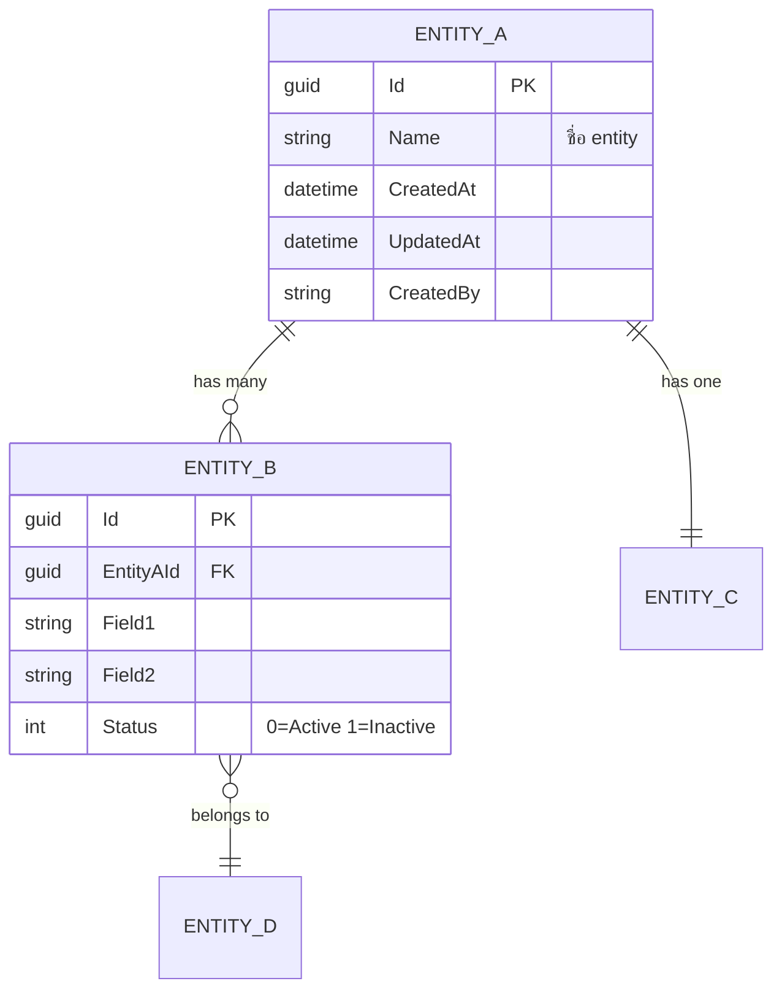
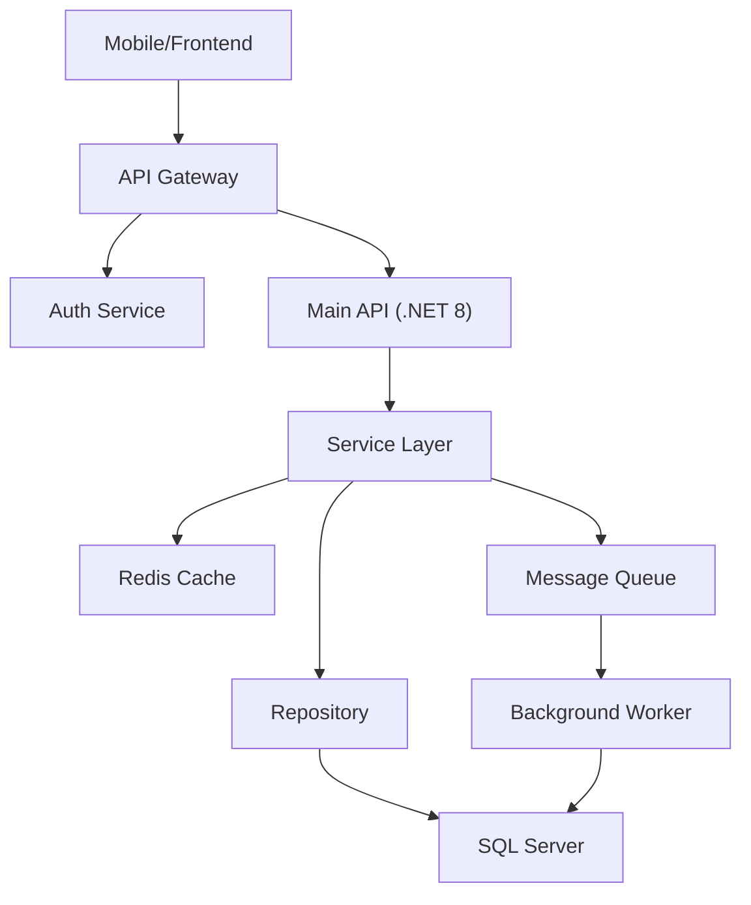
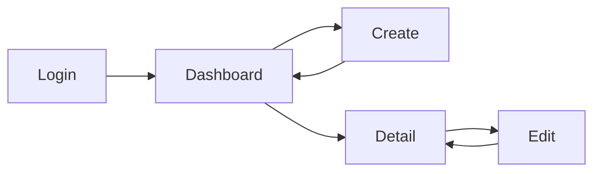

# Software Design Specification (SDS) / PRD — {Module/Feature}

> Version: 1.0
> Date: {date}
> Author: SA Agent
> Status: Draft / Review / Approved
> BRD Reference: {link to BRD Analysis}

---

## 1. Overview

### 1.1 Purpose
{วัตถุประสงค์ของเอกสารนี้}

### 1.2 Scope
{ขอบเขตของระบบ/โมดูลนี้}

### 1.3 Definitions & Abbreviations

| Term | Definition |
|------|-----------|
| {term} | {definition} |
| {term} | {definition} |

### 1.4 References

| Document | Source | Version |
|----------|--------|---------|
| BRD Analysis | {link} | v{1.0} |
| API Spec | {link} | v{1.0} |
| Existing Codebase | {repo path} | {branch} |

---

## 2. Use Cases

| UC Ref | Name | Actor | Priority | Status |
|--------|------|-------|----------|--------|
| UC-001 | {name} | {actor} | High | New/Change |
| UC-002 | {name} | {actor} | Medium | New/Change |

*(Use Case Detail อยู่ใน `use-case-template.md`)*

---

## 3. Functional Requirements

### FR-001: {ชื่อ Requirement}

| Field | Detail |
|-------|--------|
| **Module** | {module} |
| **Priority** | Must / Should / Could |
| **Complexity** | S / M / L / XL |

#### Description
{คำอธิบาย requirement อย่างละเอียด — developer อ่านแล้ว implement ได้เลย}

#### Input
| Field | Type | Source | Description |
|-------|------|--------|-------------|
| {field} | string | User/System | {description} |

#### Processing Logic
```
1. ขั้นตอนที่ 1
2. ขั้นตอนที่ 2
3. ขั้นตอนที่ 3
```

#### Output
| Field | Type | Condition | Description |
|-------|------|-----------|-------------|
| {field} | string | Success | {description} |

#### Business Rules Applied
- BR-001: {rule}
- BR-002: {rule}

#### Validation Rules
| Field | Rule | Error Message |
|-------|------|---------------|
| {field} | Required | "กรุณากรอก {field}" |
| {field} | MaxLength(100) | "{field} ต้องไม่เกิน 100 ตัวอักษร" |

#### Error Handling
| Error Condition | HTTP Status | Error Code | Message |
|----------------|-------------|-----------|---------|
| {condition} | 400 | VALIDATION_ERROR | {message} |
| {condition} | 404 | NOT_FOUND | {message} |
| {condition} | 409 | CONFLICT | {message} |

#### State Transitions
```
[State A] ──(action X)──→ [State B]
[State B] ──(action Y)──→ [State C]
[State B] ──(action Z)──→ [State A] (rollback)
```

---

### FR-002: {ชื่อ Requirement}
*(รูปแบบเดียวกับ FR-001)*

---

## 4. Non-Functional Requirements

### 4.1 Performance

| Endpoint | Expected TPS | P95 Latency | P99 Latency |
|----------|-------------|-------------|-------------|
| GET /api/resource | 100/s | < 300ms | < 500ms |
| POST /api/resource | 50/s | < 500ms | < 1000ms |

### 4.2 Security

| Layer | Requirement | Standard |
|-------|------------|----------|
| Transport | TLS 1.3 | OWASP |
| Authentication | JWT Bearer (RS256) | OAuth 2.0 |
| Authorization | Role + Policy | RBAC |
| Input Validation | Server-side + Client-side | OWASP ASVS |
| Rate Limiting | 100 req/min per user | — |
| Audit Log | All CUD operations | SOX/PDPA |

### 4.3 Availability & Resilience

| Metric | Target | Measurement |
|--------|--------|-------------|
| Uptime | 99.9% | Monthly average |
| RTO | < 1 hour | Time to restore |
| RPO | < 15 min | Data loss window |
| Backup | Daily + Transaction log | Point-in-time restore |

### 4.4 Scalability

| Dimension | Current Target | Future Target |
|-----------|---------------|---------------|
| Concurrent Users | 10,000 | 50,000 |
| Data Volume | 1M records | 50M records |
| File Storage | 100 GB | 2 TB |

---

## 5. Data Model

### 5.1 Entity Relationship Diagram


### 5.2 Data Dictionary

#### Table: {EntityA}

| Column | Type | Length | Required | PK/FK | Default | Description |
|--------|------|--------|----------|-------|---------|-------------|
| Id | uniqueidentifier | — | Yes | PK | NEWID() | Primary key |
| Name | nvarchar | 200 | Yes | — | — | ชื่อ entity |
| Status | int | — | Yes | — | 0 | 0=Active, 1=Inactive |
| CreatedAt | datetime2 | — | Yes | — | GETUTCDATE() | Timestamp |

#### Table: {EntityB}
*(รูปแบบเดียวกับ EntityA)*

### 5.3 Index Strategy

| Table | Index Name | Column(s) | Type | Rationale |
|-------|-----------|-----------|------|-----------|
| EntityA | IX_EntityA_Name | Name | Non-clustered | Search by name |
| EntityB | IX_EntityB_EntityAId | EntityAId | Non-clustered | FK lookup |

### 5.4 Enum Definitions

```csharp
public enum RecordStatus
{
    Active = 0,
    Inactive = 1,
    Deleted = 2
}
```

---

## 6. System Architecture

### 6.1 Architecture Diagram


### 6.2 Key Architecture Decisions
*(See ADR-001, ADR-002 in `adr-template.md`)*

---

## 7. API Specification (สรุป)

| Method | Path | Description | Auth |
|--------|------|-------------|------|
| GET | /api/v1/resources | List all resources | JWT |
| GET | /api/v1/resources/{id} | Get resource by ID | JWT |
| POST | /api/v1/resources | Create resource | JWT+Admin |
| PUT | /api/v1/resources/{id} | Update resource | JWT+Admin |
| DELETE | /api/v1/resources/{id} | Soft delete | JWT+Admin |

*(Full API Spec อยู่ใน `api-spec-template.md`)*

---

## 8. UI / Screen Specification

### 8.1 Screen Flow


### 8.2 Screen: {Screen Name}

| Element | Component | States | Validation |
|---------|-----------|--------|------------|
| Title | Text | Default | — |
| Form | FormGroup | Default/Error | Required fields |
| Save | Button | Enabled/Disabled/Loading | — |
| List | DataTable | Loading/Empty/Data/Error | — |

### 8.3 State Matrix

| State | Trigger | Visual | Behavior |
|-------|---------|--------|----------|
| Loading | Page load | Skeleton + Spinner | Fetch data |
| Empty | No data | "ไม่มีข้อมูล" + CTA | Show create button |
| Error | API fail | Error card + Retry | Log error |
| Success | Data loaded | Normal UI | Interactive |

---

## 9. Integration Specification

### 9.1 System Interface Matrix

| System | Interface Type | Protocol | Data Format | Auth Method | SLA |
|--------|---------------|----------|-------------|-------------|-----|
| Payment Gateway | External REST | HTTPS/REST | JSON | API Key | 99.5% |
| Notification | Internal gRPC | gRPC | Protobuf | mTLS | 99.9% |

### 9.2 Data Mapping (Source → Target)

| Source Field | Source Type | Transformation | Target Field | Target Type |
|-------------|-------------|---------------|-------------|-------------|
| user.first_name | string | Trim + TitleCase | firstName | string |
| user.birth_date | string (dd/MM/yyyy) | Parse → UTC | birthDate | datetime |

### 9.3 Error Handling for External Calls

| Pattern | Config | When |
|---------|--------|------|
| Retry | 3 times, exponential backoff | 5xx errors |
| Circuit Breaker | 5 failures → open 30s | Consecutive failures |
| Fallback | Return cached data | When circuit open |
| Timeout | 10s per call | Slow response |

---

## 10. Traceability Matrix

| BRD Ref | SDS Ref | Module | Type | Test Ref | Status |
|---------|---------|--------|------|----------|--------|
| BRD-001 | SDS-FR-001 | User Module | FR | TC-FR-001 | ✅ |
| BRD-002 | SDS-FR-002 | User Module | FR | TC-FR-002 | ✅ |
| BRD-003 | SDS-NFR-001 | System | NFR | TC-NFR-001 | ✅ |
| BRD-004 | SDS-UC-001 | User Module | UC | TC-UC-001 | ✅ |

---

## 11. Appendix

### 11.1 Open Issues
| # | Issue | Owner | Target Resolution | Status |
|---|-------|-------|-------------------|--------|
| 1 | {issue} | {name} | {date} | Open |
| 2 | {issue} | {name} | {date} | In Progress |

### 11.2 Change History
| Version | Date | Author | Change Description |
|---------|------|--------|-------------------|
| 0.1 | {date} | SA Agent | Initial draft |
| 1.0 | {date} | SA Agent | Approved |
