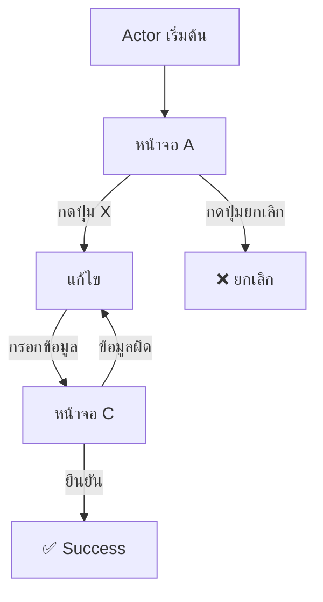

# Use Case Specification

> Template Version: 1.0

---

## UC-{XXX}: {Use Case Name}

| Field | Value |
|-------|-------|
| **Use Case ID** | UC-{XXX} |
| **Use Case Name** | {name} |
| **Actor** | {actor name} |
| **Stakeholders** | {list} |
| **Description** | {brief description} |
| **Trigger** | {what triggers this UC} |
| **Priority** | High / Medium / Low |
| **Complexity** | Simple / Medium / Complex |
| **Status** | New / Change / Deprecated |
| **Source Requirement** | BRD-{XXX}, FR-{XXX} |
| **Related Use Cases** | UC-{YYY}, UC-{ZZZ} |

---

### Pre-conditions
1. {เงื่อนไขที่ต้องเป็นจริงก่อนเริ่ม}
2. {เงื่อนไขที่ต้องเป็นจริงก่อนเริ่ม}

### Post-conditions (Success)
1. {สิ่งที่เกิดขึ้นเมื่อทำสำเร็จ}
2. {สิ่งที่เกิดขึ้นเมื่อทำสำเร็จ}

### Post-conditions (Failure)
1. {สิ่งที่เกิดขึ้นเมื่อล้มเหลว}
2. {ระบบกลับสู่สถานะเดิม}

---

### Main Flow (Basic Flow)

| Step | Actor Action | System Response |
|------|-------------|-----------------|
| 1 | {actor ทำอะไร} | — |
| 2 | — | {system ตอบสนองอย่างไร} |
| 3 | {actor ทำอะไรต่อ} | — |
| 4 | — | {system แสดงผลลัพธ์} |
| 5 | {actor ยืนยัน} | — |
| 6 | — | {system บันทึกและตอบกลับ} |

---

### Alternative Flows

#### A1: {Alternative Flow Name}
| Step | Condition | Actor Action | System Response |
|------|-----------|-------------|-----------------|
| A1.1 | {เงื่อนไขที่ทำให้เกิด Alt flow} | {actor ทำอะไร} | — |
| A1.2 | — | — | {system แสดง UI/ข้อความ} |
| A1.3 | — | — | กลับสู่ Main Flow step {N} |

#### A2: {Alternative Flow Name 2}
*(รูปแบบเดียวกับ A1)*

---

### Exception Flows

#### E1: {Error Condition}
| Step | Condition | System Response |
|------|-----------|-----------------|
| E1.1 | {error condition} | {error message ที่ผู้ใช้เห็น} |
| E1.2 | — | {system log error} |
| E1.3 | — | กลับสู่ Main Flow step {N} หรือจบ |

#### E2: {Timeout / System Error}
| Step | Condition | System Response |
|------|-----------|-----------------|
| E2.1 | System timeout > 30s | {timeout message} |
| E2.2 | — | Retry / Rollback |

---

### Business Rules

| Rule ID | Rule Description | Applied At |
|---------|-----------------|-----------|
| BR-001 | {rule} | Step {N} |
| BR-002 | {rule} | Step {N} |

---

### Screen Flow



---

### UI Elements Reference

| Screen | Element | Type | Behavior |
|--------|---------|------|----------|
| A | Title | Text | "Create Resource" |
| A | Input | TextField | Required, max 200 |
| B | Save | Button | Enabled only when valid |

---

### Validation Matrix

| Field | Validation Rule | Error Message |
|-------|---------------|--------------|
| name | Required | "กรุณากรอกชื่อ" |
| name | MaxLength(200) | "ชื่อต้องไม่เกิน 200 ตัวอักษร" |
| email | Required + Format | "กรุณากรอกอีเมลที่ถูกต้อง" |

---

### Data Included
- {data entity} — {purpose}
- {data entity} — {purpose}

---

### Acceptance Criteria (ในรูปแบบ Gherkin)

```gherkin
Scenario: {ชื่อ Scenario}
  Given {pre-condition}
  When {actor ทำ action}
  Then {ระบบตอบสนองดังนี้}

Scenario: {Error Scenario}
  Given {pre-condition}
  When {actor ทำ action ที่ผิด}
  Then {ระบบแสดง error}
  And {ระบบไม่บันทึกข้อมูล}
```

---

### Notes / Open Issues
- {note หรือ issue}
- {note หรือ issue}
